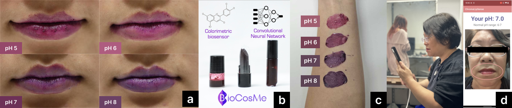

# BioCosMe: Lip-based Cosmetics with Colorimetric Biosensors for Salivary Analysis using Deep Learning

This repository contains the study code for the paper "BioCosMe: Lip-based Cosmetics with Colorimetric Biosensors for Salivary Analysis using Deep Learning," presented at ISWC ’24.

## Overview

**BioCosMe** introduces innovative lip-based biosensors designed for non-invasive health monitoring through colorimetric analysis. By leveraging the properties of lip products such as color variation and interaction with saliva, our approach provides real-time pH level detection, merging self-expression with health awareness.

## Authors

- **Shuyi Sun** - University of California, Davis, USA
- **Yuan-Hao Ku** - University of California, Davis, USA
- **Nicole Unsihuay** - Pontificia Universidad Católica del Perú, Lima, Peru
- **Omar Florez** - LatinX in AI, USA
- **Jae Yong Suk** - University of California, Davis, USA
- **Ali K. Yetisen** - Imperial College London, UK
- **Katia Vega** - University of California, Davis, USA

## Abstract

This research presents three lip-based biosensors (lipstick, lip tint, and lip gloss) that utilize colorimetric changes to display pH levels. These biosensors offer an always-available, non-invasive alternative to traditional lab-based analyses. We describe the skin-safe fabrication processes and technical evaluations for these products, alongside the development of a mobile app using a Convolutional Neural Network (CNN) model to detect pH levels.

Our dataset comprises six users, eight different lighting conditions, three cameras, and seven pH levels. Results indicate that our method improves pH detection compared to conventional techniques. Additionally, a user study with 11 participants assessed the usability of this novel approach, demonstrating its potential for convenient biochemical monitoring.

## Features

- **Lipstick, Lip Tint, and Lip Gloss Biosensors**: Designed to indicate pH levels through color changes.
- **Mobile App**: Utilizes a CNN model for pH level detection.
- **Data Collection**: Includes variations in lighting, camera conditions, and user responses.
- **Improved Detection**: Shows enhanced pH variation detection over traditional methods.
- **User Study**: Evaluates the practicality and usability of the biosensors.

## Fabrication

### Lipstick

**Ingredients:**
- Commercial Lipstick Base from TKB (33.3%) - [Link](https://tkbtrading.com/products/lip-stick-base)
- Cetyl Alcohol (8.3%) - [Link](https://a.co/d/3L3egQI)
- Non-Nano Titanium Dioxide (8.3%) - [Link](https://a.co/d/bC0Dbmd)
- Skin Safe Primer Adhesive (8.3%) - [Link](https://a.co/d/55gygY8)
- Clear Silver Mica Powder (8.3%) - [Link](https://tkbtrading.com/collections/mica?utm_source=google&utm_medium=cpc&utm_campaign=shopping)
- Red Cabbage Powder (33.3%) - [Link](https://suncorefoods.com/products/cosmos-red-cabbage-powder)

**Instructions:**
1. Heat the lipstick base until fully melted (175ºF).
2. Mix in Cetyl Alcohol, Non-Nano Titanium Dioxide, Skin Safe Primer Adhesive until melted (175ºF).
3. Stir magnetically for around 20 minutes.
4. Lower the temperature to 165ºF.
5. Mix in Clear Silver Mica Powder and Red Cabbage Powder.
6. Stir magnetically for around 10 minutes.
7. Blend by hand for around 15 minutes.
8. Pour into a pre-chilled mold (35ºF).
9. Chill for 10 minutes before demolding.

### Lip Gloss

**Ingredients:**
- Commercial Lip Gloss Base from TKB (25%) - [Link](https://tkbtrading.com/products/tkb-lip-gloss-base-flexagel)
- Glycerin (8.3%) - [Link](https://tkbtrading.com/collections/tkb-lip-gloss-versagel/products/glycerine)
- Cetyl Octanoate (8.3%)
- Non-Nano Titanium Dioxide (8.3%)
- Skin Safe Primer Adhesive (8.3%)
- Clear Silver Mica Powder (8.3%)
- Red Cabbage Powder (33.3%)

**Instructions:**
1. Heat the lip gloss base until less viscous (175ºF).
2. Mix in glycerin.
3. Place in a magnetic stirrer.
4. Mix in Cetyl Octanoate, Non-Nano Titanium Dioxide, and Skin Safe Primer Adhesive until melted (175ºF).
5. Stir magnetically for around 20 minutes.
6. Lower the temperature to 165ºF.
7. Mix in Clear Silver Mica Powder and Red Cabbage Powder.
8. Stir magnetically for around 10 minutes.
9. Blend by hand for around 15 minutes.
10. Cool until below 130ºF to safely pour into containers.

### Lip Stain/Tint

**Ingredients:**
- 30 g Red Cabbage Powder
- 8 g Clear Silver Mica Powder
- 200 mL Deionized Water
- 80 mL Vegetable Glycerin
- 5 mL Phenoxyethanol - [Link](https://a.co/d/9Vzw30U)
- 3 mL Polysorbate 80 - [Link](https://a.co/d/a4YhhxH)

**Instructions:**
1. Mix 80 mL of cold water (from the total 280 mL) with Red Cabbage Powder gradually until well combined.
2. Add glycerin.
3. Stir magnetically at 165ºF.
4. Gradually add the remaining water until the mixture reaches a consistency similar to room-temperature olive oil.
5. Lower the temperature to 120ºF.
6. Add Phenoxyethanol and Polysorbate 80.
7. Stir for 20 minutes.
8. Pour into containers.

## Software Implementation

1. **Biosensor Color Detection and CNN**: Located in the `CNNDetection` folder.
2. **Mobile Application**: Located in the `MobileApp` folder.

## Contributing

We welcome contributions to enhance the project. Please fork the repository and submit pull requests with your improvements. For major changes, please open an issue to discuss your proposal before making changes.

## License

This project is licensed under the MIT License - see the [LICENSE](LICENSE) file for details.

## Contact

For any questions or inquiries, please contact us at:

- Shuyi Sun: [shuyi.sun@ucdavis.edu](mailto:shuyi.sun@ucdavis.edu)
- Yuan-Hao Ku: [yuan-hao.ku@ucdavis.edu](mailto:yuan-hao.ku@ucdavis.edu)
- Nicole Unsihuay: [nicole.unsihuay@pucp.edu.pe](mailto:nicole.unsihuay@pucp.edu.pe)
- Omar Florez: [omar.florez@latinxinai.org](mailto:omar.florez@latinxinai.org)
- Jae Yong Suk: [jae.yong.suk@ucdavis.edu](mailto:jae.yong.suk@ucdavis.edu)
- Ali K. Yetisen: [a.yetisen@imperial.ac.uk](mailto:a.yetisen@imperial.ac.uk)
- Katia Vega: [katia.vega@ucdavis.edu](mailto:katia.vega@ucdavis.edu)

---

Explore more about our work and stay updated with our research.
